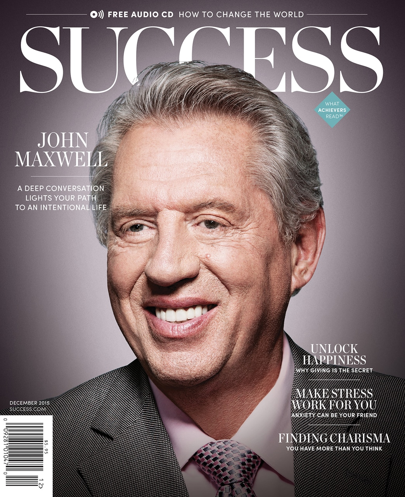

<!-- .element height="500px" .element style="border: 0; background: None; box-shadow: None" -->

----

<!-- .element height="500px" .element style="border: 0; background: None; box-shadow: None" -->
Robert Whiting

note:
- gather, teach, and inspire over 450 thousand leaders worldwide
- businesses, non-profits, and governments
- 5th for me since 2012: paid for ticket
- last year & this year CW comped PTO.
- if interested come talk to us
- who is a leader?

----

## Caveats
- firehose
- no context
- main points
- impactful quotes

note:
- hosted by a church
- leaders across business and religion because we're all people

---

## Craig Groeschel
#### Co-Founder Life.Church

<!-- .element height="500px" .element style="border: 0; background: None; box-shadow: None" -->

----

## What's important?
- manager's idea
- employee's idea

note:
- what areas do you need the most growth in?
- managers - finance, technology
- employees - leadership, emotional intelligence

----

## Following a good leader
- valued
- inspired
- empowered

note:
- 3 feelings for following a good leader: valued, inspired, empowered
- Good leader requires these 3 qualities

----

## Valued

A heart to care
> Appreciate my people more than I think I should, then double it

note:
- Heart to care

----

## Inspired

> **Inspired** employee produces 2x an employee who is **satisfied**

note:
Passion to inspire

----

## Empowered

> The strength of an organization is reflected by the depth at which people can say yes.

note:
- Willingness to empower 
- Delegate authority, not just tasks. That's how to develop new leaders. 
- "You decide, I trust you."

---

## Angela Ahrendts
#### Senior VP of Retail at Apple 

<!-- .element height="500px" .element style="border: 0; background: None; box-shadow: None" -->

----

> Develop some core values, take some time each morning to gather your thoughts. Focus on the right things and re-balance your thoughts.

----

## 2 Way Communication
- daily video to inspire teams
- employee feedback app

> Millenials are looking for more than a paycheck, they're looking for a place to belong

note:
- Loop app for feedback from employees. 
- It's a platform for employees to have a voice and make changes.
- Apple cares deeply about employee feedback.
- management: "I care, and I hear you"

----

## Jobs culture
> what do we need to be doing? the money will follow

note:
Xerox Park: when Jobs saw the UI, he started working on the future, in spite of current goals/budget.

----

## Apple retail
>Your job is **not** to sell, your job is to educate and serve

---

## Juliet Funt
#### Whitespace

<!-- .element height="300px" .element style="border: 0; background: None; box-shadow: None" -->

----

<!-- .element height="500px" .element style="border: 0; background: None; box-shadow: None" -->

note:
Story: electric shower

----

> Casualness makes us ok with bad culture, busiwork, and unhealthy practices

----

## Conformity

> If you see a change that needs to be made and don't, you're a part of the problem.

note:
- elivator standing study, people will conform to the group
- nobody changes so nothing changes. so nobody changes

----

## 2D/3D content
- 2D fact-based - text, email
- 3D rich/nuanced - phone, in person

note:
there are two types of data, 2D and 3D and they have appropriate mediums of transfer

2D - content and fact-based should be communicated with text, email
3D - rich and nuanced communication with meetings, phone, and in person
When we send 3D content via 2D methods it breaks down, and vice versa. Causes frustration.

----

## Delegation
> Allow people to fail. Hands off.

note:
1st tier people are people you trust. Delegate to 2nd tier - delegate to people you don't fully trust yet, in order to build a stronger, larger 1st tier

---

## Strive Masiyiwa
#### Founder Econet Group

<!-- .element height="500px" .element style="border: 0; background: None; box-shadow: None" -->

----

> If you solve a real problem, you don't have to spend as much on marketing - the customer will come to you

----

> If you want to be a success, identify a human need and reach out to solve it

----

## Big vision
Be willing to break it into managable bites

note:
I'm going to connect all of Africa with fiber. Be willing to break the vision down for people: just these two countries. Then two more, eventually, the vision was captured and understood.

----

> We need to treat the best of our people as volunteers, they could be working anywhere else.

note:
Respect the people who work for us 

---

## Daniel Cable 
#### Prof of Organisational Behaviour at Cornell

<!-- .element height="300px" .element style="border: 0; background: None; box-shadow: None" -->

----

## Tying work to strengths

note:
- first group of new hires talked about what their strengths were
- control did standard training
- first group had +11% NPS , +32% retention 
- positive effect of tying personal strengths to daily work

---

## Carla Harris
#### Director at Morgan Stanley

<!-- .element height="500px" .element style="border: 0; background: None; box-shadow: None" -->

----

## Leverage
- no monopoly on intelligence
- trust your team
- create a safe place

note:
Leverage - there is no monopoly on intelligence, someone on the team can do it. Encourage leaders. The secret of power is to give it away. Create  a safe place where the team members can contribute

----

## Authenticity
- comfort in your own skin
- meeting before the meeting

note:
Authenticity - authenticity is at the heart of your power. Most people are not comfortable in their own skin, so when they see it in others, they're drawn to it. The meeting before the meeting allows you to be an authentic person. Think about who you are. 

Story: Fixed Income party, invited to sing, followup conversation with head of department, also on the selection committee. Authenticity, bring your real self, because you don't know which real self will connect.

----

## Buy-in
- make a plan
- hear people out
- adjust or confirm plan

note:
Get buy-in: talk to individuals about the vision, get their feedback, even if you have a plan already–it might change, it might not.

---

## Danny Meyer
#### Restauranteur

<!-- .element height="500px" .element style="border: 0; background: None; box-shadow: None" -->

----

> The road to success is paved with mistakes well handled.

note:
49 parts technical ability
51 parts hospitality

----

> The customer is NOT always right. The customer must always feel heard.

note:
Story: Chardonnay

----

## How to handle mistakes

- Be aware of mistakes
- Acknowledge it
- Apologize
- Act on it to fix it
- Apply additional generosity
- **Write a great next chapter**

----

> I owe employees a lot more than a paycheck. They could be working anywhere, and they choose to work here.

note:
building a vision and culture is so important!

----

> The best talent in the world is looking for a place to belong.

---

## Danielle Strickland
#### Justice Advocate

<!-- .element height="500px" .element style="border: 0; background: None; box-shadow: None" -->

----

> Women and men are better together

note:
- women's rights in other countries
- double GDP in some countries if women were allowed to own businesses
- diversity of opinion
- everyone brings value

----

> How we use our power is the measure of our leadership

----

> Great leaders use power to empower others

---

## John C Maxwell
#### Leadership expert

<!-- .element height="500px" .element style="border: 0; background: None; box-shadow: None" -->

----

> Intentionally grow every day. 

note:
- if you're still excited about what you did 5 years ago, you're not growing
- Spend 1hr a day learning
- put yourself in places with people who inspire you

----

> Always have a vision gap

note:
- requires you to need more and more
- gap between what you can do and what you want to do

---

## Rasmus Ankersen
#### Author & Entrepeneur

<!-- .element height="500px" .element style="border: 0; background: None; box-shadow: None" -->

----

<!-- .element height="500px" .element style="border: 0; background: None; box-shadow: None" -->

note:
Nokia 3310 story: resilience, quality
- from 50% to 3% market share in <3 years
- Arrogance, complacency, resistance to change

----

## Outcome bias 
> Assumption that good results come from good decisions

> Success turns luck into genius

----

## professional gambling

note:
- Use the weapons of professional gambling: the data. 
- There is randomness in the market, but some features cause higher win rates. Use those, not the noise. 
- You must measure.

----

> Treat success with the same skepticism as failure

----

> Re-frame the market to be the small entrepreneur again

note:
- Coke re-framed from soft drink market to drinking fluids market
- LEGO re-framed from kid's toy market (vs plastic toys) to playroom market (vs Apple)
  - movies, games

---

## David Livermore
#### President Cultural Learning Center

<!-- .element height="500px" .element style="border: 0; background: None; box-shadow: None" -->

----

## Diversity and Innovation
Cultural intelligence is key to a high-functioning diverse team

note:
- [Cultural knowledge without good strategy/action](https://www.youtube.com/watch?v=DWynJkN5HbQ)
- Diversity leads to innovation? not true, there's more to it. Homogeneous teams were more innovative unless there was a high Cultural Intelligence, then the diverse teams outperformed homogeneous teams by 3x
- Just teaching differences can cause more harm than good

----

## How?
- Curiosity
- Knowledge
- Strategy
- Action

note:
- Curiosity - humble curiosity, exercise perspective taking
- Knowledge - learn/study facts
- Strategy - stop and think
- Action - know when to adapt and when to not adapt

---

## Sheila Heen
#### Triad Consulting Group

<!-- .element height="450px" .element style="border: 0; background: None; box-shadow: None" -->

----

> Everyone has difficult conversations - your job is having these conversations

note:
Bad news - they stink, which is good because it shows that you care for the mission and the people

----

## Internal story

- who's right?
- who's fault is it?
- what was the intent?

note:
Everyone has an internal voice with this story:
Change the story, change the 3 questions to align better with reality:

----

## Re-write the internal story
note:
- who's right? what's this conversation really about?
- who's fault is it? what have we each contributed? for good or ill?
- what was the intent? separate intent from impact, what's the impact?
- No silver bullet, consistency is important
- Don't be surprised if you have to keep having those same conversations

---

## Simon Sinek
#### Optimist

<!-- .element height="500px" .element style="border: 0; background: None; box-shadow: None" -->

----

## Two games
- finite
- infinite

note:
- finite - known players, rules, win condition
- infinite - changing rules, players, the goal is to keep playing, playing against yourself

----

## The wrong game
- Vietnam
- Apple vs Microsoft

note:
story: Vietnam
story: Apple vs Microsoft

----

## Trusting teams
> Like is rational, love is emotional

note:
- story: Barista at 4 seasons, same kid works elsewhere: any manager will walk by and see who I'm doing, elsewhere, I keep my head down because I'm scrutinized, and checked for correctness
- Trusting Teams - like is rational, love is emotional, huge gap.

----

> How do I create an environment where I can put people at their natural best? 

note:
A place where I can be my best?
- identify strengths & desires of team members
- placing people in positions where they can use their strengths

----

> We don't trust people to follow the rules, we trust them to know when to break them.

---

## Craig Groeschel
#### Co-Founder Life.Church

<!-- .element height="300px" .element style="border: 0; background: None; box-shadow: None" -->

----

> The difference between a good and great leader is learning to anticipate instead of react

----

## Curse of confidence
- resisting feedback
- answering more than asking
- assuming too much

note:
- Beware the curse of confidence
- difficult to receive feedback
- answering more questions than we're asking
- assuming too much, not innovating

----

> If we are not changing, we're falling further behind

note:
what you "know" could be wrong

----

## Innovation
> practice thinking outside your field

note:
- practice thinking outside your field
- create theories
- train yourself to anticipate future trends

----

> Innovation is seeing what everybody else sees and thinking what nobody else thinks.

----

## Company assessment
- What is the true current state?
- If you were starting now...
- What would you attempt? 

note:
3 questions
- What is the true current state? ask why
- If you were starting now, what would you do differently? Why are you still doing it?
- What would you attempt? When will you do that?

---

## Conclusions

----

> play the infinite game

note:
- work for the ideals and purpose
- identify a human need, fill it
- customers will come

----

> care for my people

----

> create a place of belonging and empowerment

----

> read a bunch of books